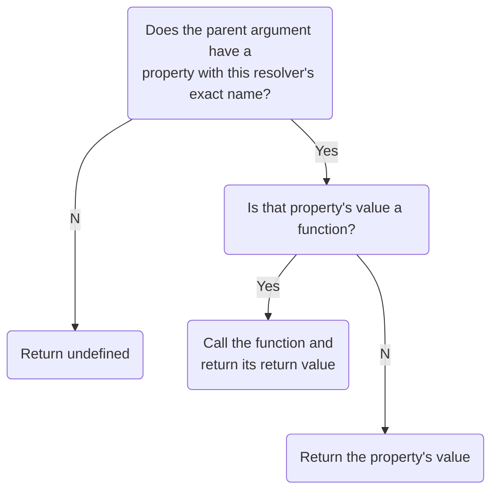

## Define other resolvers

You might have noticed that the [test queries](#run-test-queries) we ran above included several fields that we haven't even written resolvers for. But somehow those queries still ran successfully! That's because Apollo Server defines a **default resolver** for any field you don't define a custom resolver for.

A default resolver function uses the following logic:



For most (but not all) fields of our schema, a default resolver does exactly what we want it to. Let's define a custom resolver for a schema field that needs one, `Mission.missionPatch`.

This field has the following definition:

```graphql
# YOU DON'T NEED TO COPY THIS CODE.
type Mission {
  # Other field definitions...
  missionPatch(size: PatchSize): String
}
```

The resolver for `Mission.missionPatch` should return a different value depending on whether a query specifies `LARGE` or `SMALL` for the `size` argument.

Add the following to your resolver map in `src/resolvers.js`, below the `Query` property:

```js{4-11}:title=src/resolvers.js
// Query: {
//   ...
// },
Mission: {
  // The default size is 'LARGE' if not provided
  missionPatch: (mission, { size } = { size: 'LARGE' }) => {
    return size === 'SMALL'
      ? mission.missionPatchSmall
      : mission.missionPatchLarge;
  },
},
```

This resolver obtains a large or small patch from `mission`, which is the object returned by the default resolver for the _parent_ field in our schema, `Launch.mission`.

Now that we know how to add resolvers for types besides `Query`, let's add some resolvers for fields of the `Launch` and `User` types. Add the following to your resolver map, below `Mission`:

```js{4-22}:title=src/resolvers.js
// Mission: {
//   ...
// },
Launch: {
  isBooked: async (launch, _, { dataSources }) =>
    dataSources.userAPI.isBookedOnLaunch({ launchId: launch.id }),
},
User: {
  trips: async (_, __, { dataSources }) => {
    // get ids of launches by user
    const launchIds = await dataSources.userAPI.getLaunchIdsByUser();

    if (!launchIds.length) return [];

    // look up those launches by their ids
    return (
      dataSources.launchAPI.getLaunchesByIds({
        launchIds,
      }) || []
    );
  },
},
```

You might be wondering how our server knows the identity of the current user when calling functions like `getLaunchIDsByUser`. It doesn't yet! We'll fix that in the next chapter.

